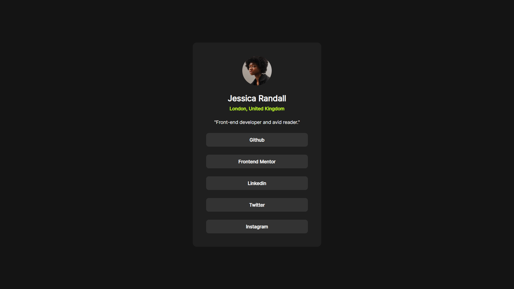

# Frontend Mentor - Social links profile solution

This is a solution to the [Social links profile challenge on Frontend Mentor](https://www.frontendmentor.io/challenges/social-links-profile-UG32l9m6dQ). Frontend Mentor challenges help you improve your coding skills by building realistic projects.

## Table of contents

- [Overview](#overview)
  - [The challenge](#the-challenge)
  - [Screenshot](#screenshot)
  - [Links](#links)
- [My process](#my-process)
  - [Built with](#built-with)
  - [What I learned](#what-i-learned)
  - [Continued development](#continued-development)
- [Author](#author)

## Overview

### The challenge

Users should be able to:

- See hover and focus states for all interactive elements on the page

### Screenshot

### Links

- Solution URL: [https://github.com/kishanlalbj/social-links](https://github.com/kishanlalbj/social-links)
- Live Site URL: [Add live site URL here](https://your-live-site-url.com)

## My process

### Built with

- Semantic HTML5 markup
- Flexbox
- Mobile-first workflow

### What I learned

Refreshed my plain HTML, CSS and JS skills after being working on frameworks.

### Continued development

I Should use BEM notaions and should write clean css classes moving forward

## Author

- Website - [Kishanlal B J](https://www.kishanlalbj.dev)
- Frontend Mentor - [@kishanlalbj](https://www.frontendmentor.io/profile/kishanlalbj)
- Twitter - [@ItsKishanlal](https://www.twitter.com/ItsKishanlal)
